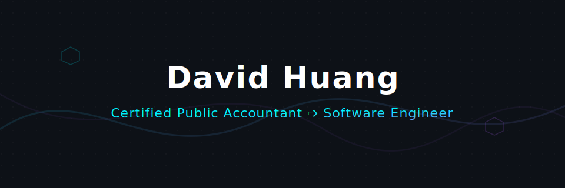

  

  
  

---

### 🚀 Professional Journey

I am a **Certified Public Accountant turned Software Engineer**. 

My shift into software engineering is a vertical evolution rather than a horizontal pivot. While my objective is not simply to write tax or financial software, I am driven to build practical, scalable applications that target and solve real, existing problems.

Before writing code, I spent 8 years in public accounting, primarily working as a tax accountant specializing in compliance, planning, and strategy across various industries, alongside experience as a financial statement auditor. Today, I leverage that analytical background to build modern fullstack web applications and optimize them for search, visibility, and user growth.

---

### 💻 Current Endeavors

| Metric / Area | Focus |
| :--- | :--- |
| 🔭 **Current Focus** | Designing a financial SaaS application (bridging my accounting expertise with fullstack web tools to solve a high-friction problem) |
| 🧠 **Learning & Exploring** | Fullstack web architectures, AI systems integration (Prompt Engineering, Stable Diffusion/Generative AI models), and growth strategy (including SEO, AEO optimization, and targeted advertising) |
| ⚡ **Fun Fact** | I designed my very first website and logo from scratch in HTML & CSS at age 14! |

---

### 🛠️ Languages and Tools

  <!-- Highly Searched Fullstack Stack -->
  
  
  
  
  
  
  
  
   
  <!-- AI & Generative Engineering -->
  
  
  
  
  
  
  
  
   
  <!-- Core Standards -->
  
  

---

### 📊 GitHub Activity & Metrics

<table align="center" border="0" cellpadding="0" cellspacing="0">
  <tr>
    <td width="50%" align="center" valign="top">
      
    </td>
    <td width="50%" align="center" valign="top">
      
    </td>
  </tr>
  <tr>
    <td colspan="2" align="center" valign="top" width="100%">
       
      
    </td>
  </tr>
</table>

  

